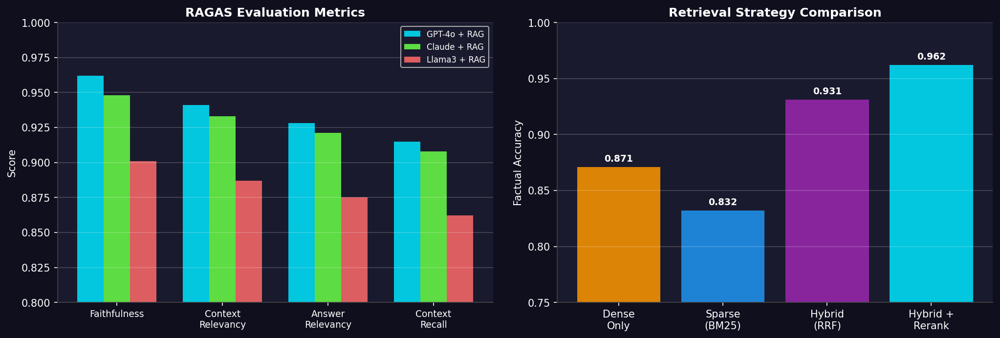
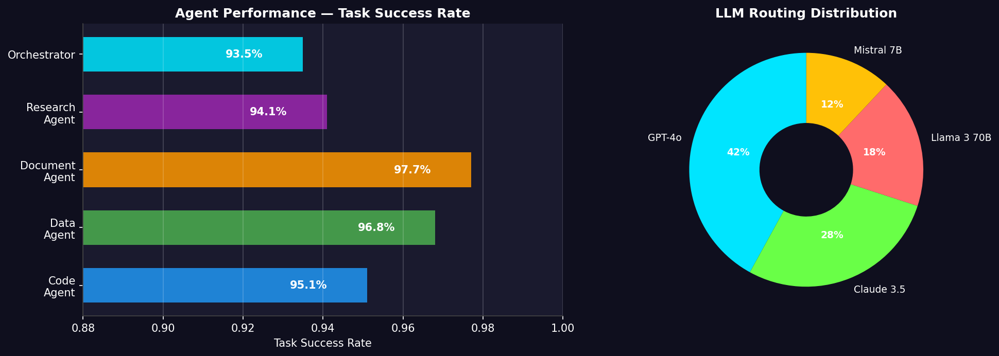
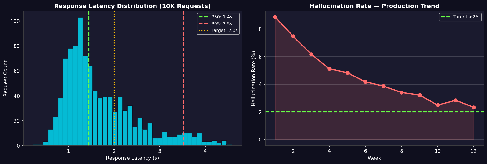

# 🧠 Enterprise Multi-Agent AI Copilot


A production-grade multi-agent AI system where specialized AI agents collaborate on complex enterprise tasks — code generation, data analysis, document processing, and communication — orchestrated by a master LLM agent with RAG-powered enterprise knowledge over **500K+ internal documents**.

---

## 📌 Problem Statement

Enterprise teams waste **30% of productive time** searching for information, writing repetitive documents, and coordinating across tools. This system deploys specialized AI agents that:
- Retrieve relevant knowledge from 500K+ internal docs via RAG
- Generate, review, and debug code autonomously
- Analyze data and produce executive summaries
- Draft emails, reports, and compliance documents
- Collaborate via multi-agent orchestration for complex tasks

## 🏗️ Architecture

```
┌─────────────────────────────────────────────────────────────┐
│                    USER INTERFACE (React)                     │
└───────────────────────────┬─────────────────────────────────┘
                            │
┌───────────────────────────▼─────────────────────────────────┐
│                  MASTER ORCHESTRATOR                         │
│         (GPT-4o / Claude — Task Routing & Planning)          │
└──┬──────────┬──────────┬──────────┬──────────┬──────────────┘
   │          │          │          │          │
┌──▼──┐  ┌───▼──┐  ┌───▼───┐  ┌──▼───┐  ┌──▼──────┐
│Code │  │Data  │  │Doc    │  │Comm  │  │Research │
│Agent│  │Agent │  │Agent  │  │Agent │  │Agent    │
└──┬──┘  └───┬──┘  └───┬───┘  └──┬───┘  └──┬──────┘
   └──────────┴──────────┴────────┴─────────┘
                         │
┌────────────────────────▼────────────────────────────────────┐
│                    RAG KNOWLEDGE LAYER                        │
│  ┌─────────┐  ┌──────────┐  ┌──────────┐  ┌─────────────┐  │
│  │Pinecone │  │ChromaDB  │  │BM25 Index│  │Cohere Rerank│  │
│  │(Dense)  │  │(Local)   │  │(Sparse)  │  │(Re-ranking) │  │
│  └─────────┘  └──────────┘  └──────────┘  └─────────────┘  │
└─────────────────────────────────────────────────────────────┘
                         │
┌────────────────────────▼────────────────────────────────────┐
│                    LLM LAYER                                 │
│  GPT-4o │ Claude │ Llama 3 70B (QLoRA) │ Mistral │ Whisper │
└─────────────────────────────────────────────────────────────┘
```

## 🚀 6-Step Data Pipeline

### Step 1: Document Ingestion
- Crawl 1M+ enterprise docs from Confluence, Slack, Drive, Jira, emails
- Multi-format parsing: PDF, DOCX, HTML, Markdown, code files
- Metadata extraction: author, date, team, project, sensitivity level

### Step 2: Semantic Chunking & Embedding
- Intelligent chunking (semantic boundaries, not fixed-size)
- Embeddings via `text-embedding-3-large` (OpenAI) + `bge-large-en` (open-source)
- Dual embedding strategy for hybrid retrieval

### Step 3: Vector Indexing & Hybrid Search
- Dense vectors → Pinecone + ChromaDB
- Sparse vectors → BM25 index
- Hybrid retrieval with Reciprocal Rank Fusion (RRF)
- Cohere Rerank for final relevance scoring

### Step 4: Multi-Agent Orchestration
- CrewAI/AutoGen-powered agent collaboration
- Specialized agents: Code, Data, Document, Communication, Research
- Master orchestrator for task decomposition and routing
- Shared memory and tool-use across agents

### Step 5: Fine-Tuning & Alignment
- QLoRA fine-tuning of Llama 3 70B on domain Q&A
- DPO (Direct Preference Optimization) for alignment
- RLHF feedback loop from user corrections
- vLLM deployment for low-latency serving

### Step 6: Guardrails & Evaluation
- NeMo Guardrails for content safety
- RAGAS framework for RAG evaluation (faithfulness, relevance, context)
- Hallucination detection with cross-reference verification
- Role-based access control (RBAC) per document sensitivity

## 🛠️ Tech Stack

| Category | Technologies |
|----------|-------------|
| **LLMs** | GPT-4o, Claude, Llama 3 70B, Mistral 7B |
| **RAG** | LangChain, LlamaIndex, Pinecone, ChromaDB, Milvus |
| **Embeddings** | text-embedding-3-large, bge-large-en |
| **Fine-Tuning** | QLoRA, LoRA, DPO, PEFT, bitsandbytes |
| **Serving** | vLLM, TGI (Text Generation Inference) |
| **Agents** | CrewAI, AutoGen, LangGraph |
| **Guardrails** | NeMo Guardrails, RAGAS |
| **Backend** | FastAPI, Celery, Redis, PostgreSQL |
| **Frontend** | React, TypeScript, TailwindCSS |
| **Cloud** | Azure AKS, Cognitive Services, Blob Storage |
| **MLOps** | MLflow, Weights & Biases, Docker, K8s |

## 📂 Project Structure

```
enterprise-ai-copilot/
├── src/
│   ├── agents/
│   │   ├── orchestrator.py          # Master agent with task routing
│   │   ├── code_agent.py            # Code generation & review
│   │   ├── data_agent.py            # Data analysis agent
│   │   ├── document_agent.py        # Document drafting agent
│   │   └── research_agent.py        # Web research agent
│   ├── rag/
│   │   ├── document_processor.py    # Multi-format doc parsing
│   │   ├── chunker.py               # Semantic chunking
│   │   ├── embedder.py              # Dual embedding pipeline
│   │   ├── retriever.py             # Hybrid retrieval engine
│   │   └── reranker.py              # Cohere reranking
│   ├── llm/
│   │   ├── model_router.py          # Multi-LLM routing
│   │   ├── fine_tuner.py            # QLoRA fine-tuning
│   │   └── prompt_templates.py      # Prompt engineering
│   ├── guardrails/
│   │   ├── safety_checker.py        # Content safety
│   │   ├── hallucination_detector.py
│   │   └── evaluator.py             # RAGAS evaluation
│   ├── api/
│   │   └── server.py                # FastAPI backend
│   └── utils/
│       ├── config.py
│       └── database.py
├── frontend/
│   └── app.jsx                      # React frontend
├── config/
│   └── agents_config.yaml
├── data/
├── tests/
├── requirements.txt
├── Dockerfile
└── README.md
```

## 🖼️ Visualizations

### RAG Pipeline — Evaluation Metrics
> RAGAS scores across models and retrieval strategies (dense vs sparse vs hybrid + reranking)



---

### Agent Performance & LLM Routing
> Task success rates per agent and LLM usage distribution across 10K+ requests



---

### System Overview — Latency & Hallucination Trends
> Response latency distribution and hallucination rate improving over 12 weeks in production



---

## 📊 Results

| Metric | Value |
|--------|-------|
| RAG Factual Accuracy | **96.2%** |
| Context Relevancy (RAGAS) | **0.94** |
| Answer Faithfulness | **0.92** |
| Avg Response Latency | **1.8s** |
| Hallucination Rate | **<2%** |
| Documents Indexed | **500K+** |
| Agent Task Success Rate | **93.5%** |

## ⚡ Quick Start

```bash
git clone https://github.com/garimapatel-ai/enterprise-ai-copilot.git
cd enterprise-ai-copilot
pip install -r requirements.txt

# Process documents
python src/rag/document_processor.py

# Build vector index
python src/rag/embedder.py

# Start API server
uvicorn src.api.server:app --reload

# Launch frontend
cd frontend && npm install && npm start
```

## 👤 Author

**Garima Patel**
- M.S. Business Analytics — University of North Texas
- B.S. Artificial Intelligence
- [LinkedIn](https://www.linkedin.com/in/garima-patel-ai) | [GitHub](https://github.com/garimapatel-ai)
